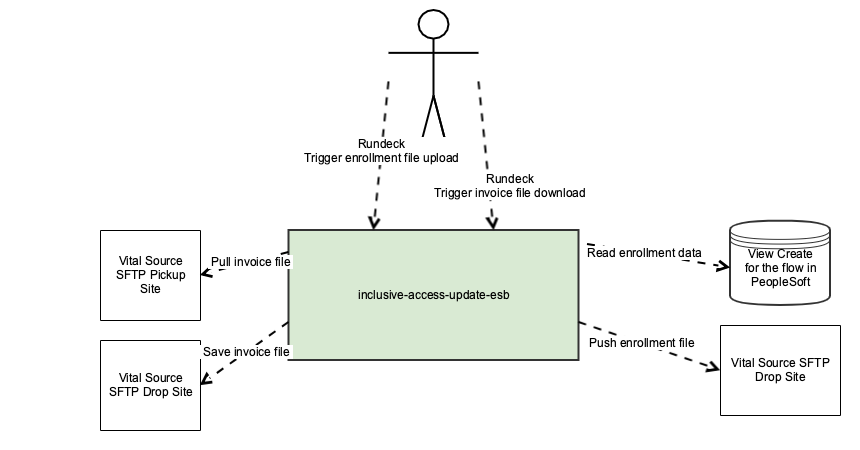
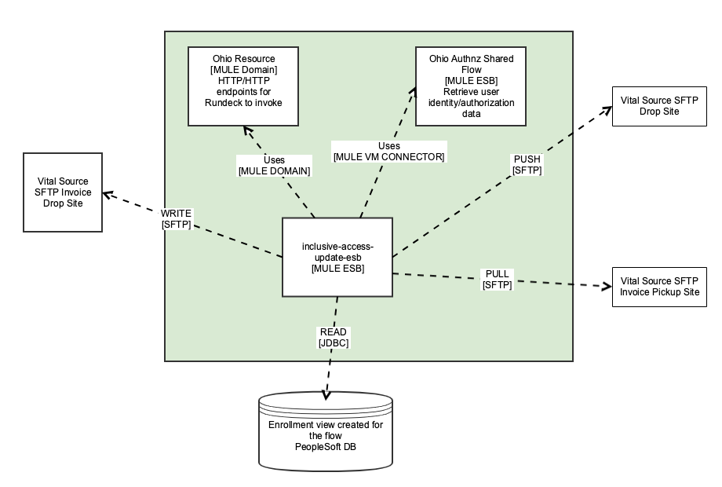
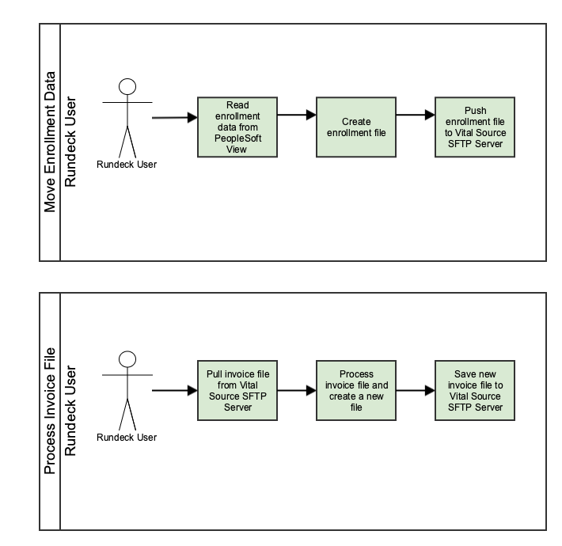

# inclusive-access-update-esb

<table class="wrapped confluenceTable">
<tbody>
<tr class="odd">
<td class="highlight-blue confluenceTd" style="text-align: right;"
data-highlight-colour="blue"><strong>Creator:</strong></td>
<td class="confluenceTd">Garrett Brant, Mesut Ceviker</td>
</tr>
<tr class="even">
<td class="highlight-blue confluenceTd" style="text-align: right;"
data-highlight-colour="blue"><strong>Customers/Applications</strong>:</td>
<td class="confluenceTd">
 TBD
</td>
</tr>
<tr class="odd">
<td class="highlight-blue confluenceTd" style="text-align: right;"
data-highlight-colour="blue"><strong>Server</strong>:</td>
<td class="confluenceTd">Mule Server (hubx1 instance)</td>
</tr>
<tr class="even">
<td class="highlight-blue confluenceTd" style="text-align: right;"
data-highlight-colour="blue"><strong>URLs:</strong></td>
<td class="confluenceTd">

<table class="wrapped confluenceTable">
<tbody>
<tr class="odd">
<td class="highlight-blue confluenceTd" style="text-align: right;"
data-highlight-colour="blue"><strong>Dev:</strong></td>
<td
class="confluenceTd">https://{{mule.dev}}/api/inclusive-access-update-esb</td>
</tr>
<tr class="even">
<td class="highlight-blue confluenceTd" style="text-align: right;"
data-highlight-colour="blue"><strong>Test:</strong></td>
<td
class="confluenceTd">https://{{mule.test}}/api/inclusive-access-update-esb</td>
</tr>
<tr class="odd">
<td class="highlight-blue confluenceTd" style="text-align: right;"
data-highlight-colour="blue"><strong>QA:</strong></td>
<td
class="confluenceTd">https://{{mule.qa}}/api/inclusive-access-update-esb</td>
</tr>
<tr class="even">
<td class="highlight-blue confluenceTd" style="text-align: right;"
data-highlight-colour="blue"><strong>Prod:</strong></td>
<td
class="confluenceTd">https://{{mule.prod}}/api/inclusive-access-update-esb</td>
</tr>
</tbody>
</table>

</td>
</tr>
<tr class="odd">
<td class="highlight-blue confluenceTd" style="text-align: right;"
data-highlight-colour="blue">
<strong>Architecture
Documentation:</strong>
</td>
<td class="confluenceTd">

Context Diagram

 

Container Diagram

Use Case Diagrams

 

</td>
</tr>
<tr class="even">
<td class="highlight-blue confluenceTd" style="text-align: right;"
data-highlight-colour="blue"><strong>Service ReadMe:</strong></td>
<td class="confluenceTd"> A <a href="http://readme.md/"
rel="nofollow">README.md</a> file should be created in the master branch
of the source code and it should be linked to here.</td>
</tr>
</tbody>
</table>

## Attachments:

[temp.png](attachments/172753748/172753758.png) (image/png)  

[container_dig.png](attachments/172753748/172753759.png) (image/png)  

[Appointment Creation Flow Lanes Copy
Copy.png](attachments/172753748/172753784.png) (image/png)  
 [temp
(1).png](attachments/172753748/172753796.png) (image/png)  

[container_dig (1).png](attachments/172753748/172753807.png)
(image/png)  
